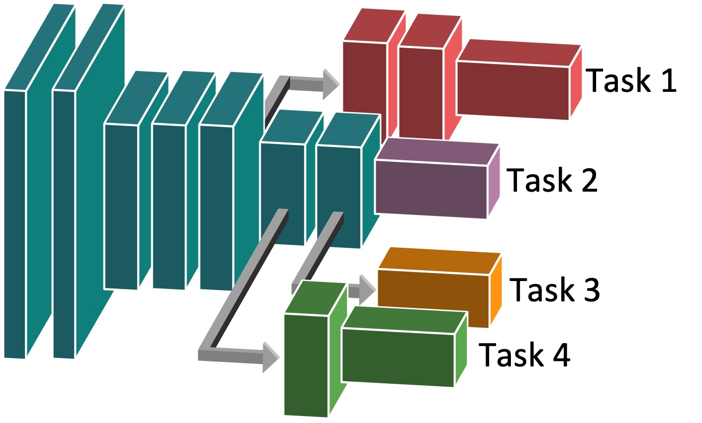

# [Task Adaptive Parameter Sharing for Multi-Task Learning](https://arxiv.org/abs/2203.16708)

Unofficial Pytorch implementation of **Task Adaptive Parameter Sharing** (CVPR 2022). <br />


<p align="center">

</p>

Task Adaptive Parameter Sharing (TAPS) is a general method for tuning a base model to a new task by adaptively modifying a small, task-specific subset of layers. This enables multi-task learning while minimizing resources used and competition between tasks. TAPS solves a joint optimization problem which determines which layers to share with the base model and the value of the task-specific weights.


## Installation

### Requirements

### Datasets

**ImageNet-to-Sketch**
The 5 datasets comprising ImagetNet-to-Sketch can be download from the [PiggyBack repository](https://github.com/arunmallya/piggyback) at this link: [https://uofi.box.com/s/ixncr3d85guosajywhf7yridszzg5zsq](https://uofi.box.com/s/ixncr3d85guosajywhf7yridszzg5zsq)

Place the datasets in the datasets folder.

## Training

### Training Options

### Sequential Task Training
```
python train_sequential.py --learning_rate .005 --dataset ../datasets/DomainNet/sketch --experiment_name ./results/sketch
```


### Joint Multi-Task Training


## Evaluation

### Tensorboard

### Visualizing Modified Layers
